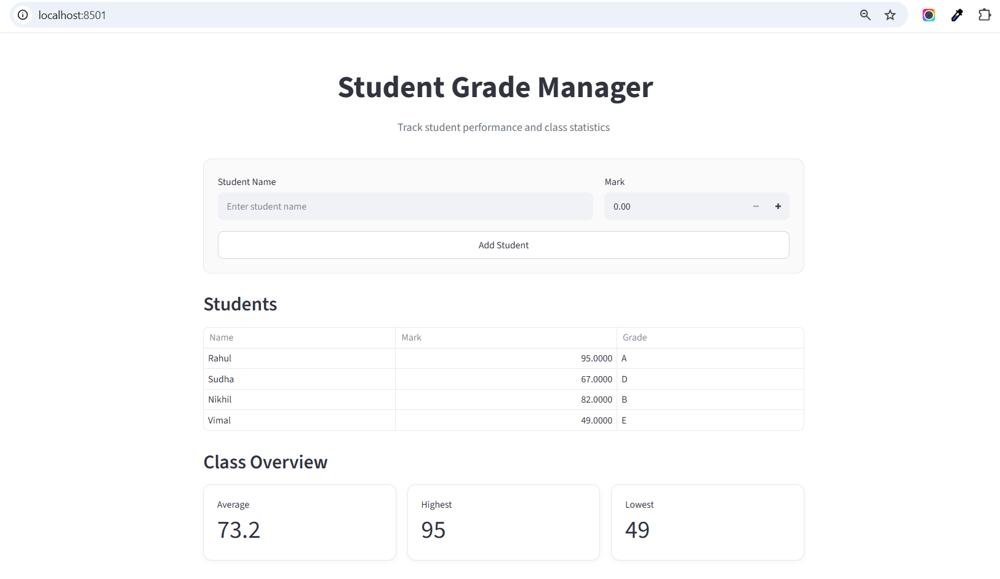

# Student Grade Manager

A simple Streamlit web application that brings the python grade calculator into the browser. It accepts student names and marks, keeps the data across Streamlit reruns with `st.session_state`, displays the grades in a table, and shows class statistics.

The grading scale:

| Mark | Grade |
|---|---|
| 90–100 | A |
| 80–89 | B |
| 70–79 | C |
| 60–69 | D |
| Below 60 | E |

## Requirements

- Python 3 installed
- A terminal or command prompt
- Streamlit

## Project Structure

```text
grade-app/
├── grade_app.py
├── requirements.txt
├── README.md
├── .gitignore
└── screenshots/
    └── app-demo.png
```

The `.venv` directory is created locally and is excluded from Git.

## Setup

Create the project environment:

```cmd
python -m venv .venv
```

Activate it on Windows Command Prompt:

```cmd
.venv\Scripts\Activate
```

For Windows PowerShell:

```powershell
.venv\Scripts\Activate.ps1
```

For macOS/Linux:

```bash
source .venv/bin/activate
```

Install the dependency:

```bash
pip install -r requirements.txt
```

## Run

Start the Streamlit application with:

```bash
streamlit run grade_app.py
```

Streamlit will display the local URL in the terminal. Open it in a browser.

Do not run the application with `python grade_app.py`; use `streamlit run`.

## Usage

1. Enter a student's name.
2. Enter a mark from 0 to 100.
3. Select `Add`.
4. Repeat to add additional students.
5. The table and class metrics update automatically.

The interface rejects marks outside the 0–100 range and requires a student name.

## Streamlit State

Streamlit reruns the script when the user interacts with the page. The student list is therefore stored in `st.session_state` so previously added students remain available across those reruns.

Without `st.session_state`, a normal list created at the top of the script would be recreated on each rerun and previously added students would be lost.

## Class Metrics

The page displays:

- Average mark
- Highest mark
- Lowest mark

## Screenshot




## GitHub

After testing the application:

```bash
git init
git add .
git commit -m "Add Streamlit grade manager"
git branch -M main
git remote add origin <your-repository-url>
git push -u origin main
```

Do not commit `.venv`.
